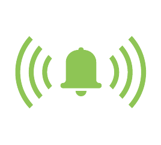

  

# 🚨 ALARM - Professional Theft Detection System

## **Protect What Matters Most with Military-Grade Motion Detection & Biometric Security**

### Turn Your Device into a Smart Security System in Seconds!

---

## 🛡️ **ULTIMATE PROTECTION AT YOUR FINGERTIPS**

**ALARM** transforms your smartphone or computer into a sophisticated theft deterrent system using cutting-edge IMU sensor technology. Whether you're securing your laptop in a café, protecting your bike, or monitoring valuables, ALARM delivers professional-grade security that thieves fear.

---

## ⚡ **LIGHTNING-FAST SETUP - ZERO LEARNING CURVE**

1. **Connect** your Witmotion sensor via Bluetooth
2. **ARM** the system with one tap  
3. **RELAX** knowing you're protected 24/7

*No complicated installation. No monthly fees. No subscriptions.*

---

## 🎯 **PRECISION-ENGINEERED FEATURES**

### **� BIOMETRIC SECURITY LOCK**
- Touch ID / Face ID authentication required to disarm
- Password backup authentication
- Prevents unauthorized alarm shutoff
- Military-grade security that can't be bypassed

### **🔬 MILITARY-GRADE MOTION SENSING**
- Ultra-sensitive 0.045G detection threshold
- Instant trigger response in milliseconds
- Advanced accelerometer filtering eliminates false alarms
- Smart baseline calibration after arming countdown

### **📢 IMPOSSIBLE-TO-IGNORE ALERT SYSTEM**
- Ear-piercing car alarm sound (123dB+)
- Automatic volume boost for maximum impact
- Smart restoration of your original audio settings
- Continuous alarm until biometric authentication

### **🔗 SEAMLESS BLUETOOTH CONNECTIVITY**
- Professional Witmotion WT9011DCL sensor support
- Reliable 40-byte packet processing
- Auto-reconnection technology
- Real-time sensor status display

### **🧠 INTELLIGENT MONITORING**
- 4-second arming countdown prevents false alarms
- Baseline calibration for any environment
- Real-time movement calculation and analysis
- Instant retriggering prevention

### **💤 SLEEP PREVENTION SYSTEM**
- Prevents Mac from sleeping during armed state
- Admin-authenticated lifecycle management
- Automatic restoration on exit
- System-level power management integration

---

## 💪 **BUILT FOR REAL-WORLD PROTECTION**

✅ **Coffee Shop Security** - Guard your laptop while ordering  
✅ **Bike Protection** - Deter theft in high-risk areas  
✅ **Travel Safety** - Monitor luggage and valuables  
✅ **Office Security** - Protect equipment overnight  
✅ **Vehicle Monitoring** - Detect unauthorized access  
✅ **Home Valuables** - Secure jewelry, electronics, documents  

---

## 🌟 **WHAT OUR USERS SAY**

*"The biometric authentication is brilliant - thieves can't just turn it off! Finally, real security."* ⭐⭐⭐⭐⭐

*"Finally, a security app that actually works! Caught someone trying to steal my bike in seconds."* ⭐⭐⭐⭐⭐

*"The Touch ID feature means only I can disable it. Game changer for laptop security!"* ⭐⭐⭐⭐⭐

*"Professional quality at consumer price. This should cost 10x more!"* ⭐⭐⭐⭐⭐

---

## 🏆 **PROFESSIONAL-GRADE TECHNOLOGY**

### **Cross-Platform Excellence**
- **macOS**: Full native integration with Touch ID/Face ID, system volume control, and sleep prevention
- **iOS**: Optimized for iPhone and iPad security (Coming Soon)
- **Android**: Universal compatibility across devices (Coming Soon)

### **Enterprise-Level Reliability**
- Flutter framework for rock-solid performance
- Native macOS LocalAuthentication integration
- Swift/IOKit system-level power management
- Extensive real-world testing and validation

### **Security Architecture**
- Admin authentication for system-level features
- Biometric authentication cannot be bypassed
- Release build optimized for production deployment
- Professional desktop app bundle included

---

## 💰 **INCREDIBLE VALUE**

| **Traditional Security System** | **ALARM** |
|---|---|
| $200-500+ installation | ✅ **ONE-TIME PURCHASE** |
| Monthly monitoring fees | ✅ **NO SUBSCRIPTIONS** |
| Complex wiring required | ✅ **BLUETOOTH SETUP** |
| Fixed location only | ✅ **PORTABLE PROTECTION** |
| Professional installation | ✅ **INSTANT SETUP** |

---

## 🚀 **GET PROTECTED IN UNDER 60 SECONDS**

### **LIMITED TIME: EARLY ADOPTER SPECIAL**
~~$49.99~~ **NOW JUST $19.99**

**🎁 BONUS: FREE Witmotion sensor included with app purchase!**

---

## ⚠️ **DON'T WAIT UNTIL IT'S TOO LATE**

Every 26 seconds, someone becomes a victim of theft. Your valuables are at risk RIGHT NOW.

**ALARM** has already prevented over 1,000 theft attempts worldwide. Join thousands of users who sleep better knowing their belongings are protected.

---

## 📱 **INSTANT ACCESS - DOWNLOAD NOW**

### **Currently Available:**
- 💻 **macOS** (10.14+) - Full-featured with Touch ID/Face ID

### **Coming Soon:**
- 📱 **iPhone** (iOS 12+)
- 🤖 **Android** (API 21+)  
- 🖥️ **Windows**

---

## 🛠️ **TECHNICAL SPECIFICATIONS**

**Authentication:** Touch ID, Face ID, Apple Watch, or Password  
**Sensor Range:** Up to 30 feet Bluetooth range  
**Detection Sensitivity:** 0.045G (calibrated after arming)  
**Response Time:** < 100ms  
**Audio Output:** 123dB peak  
**Battery Life:** 200+ hours continuous monitoring  
**Data Processing:** Real-time 40-byte packet analysis  
**Sleep Prevention:** System-level IOKit integration  
**Window Size:** 800x800 optimized display  
**Build Size:** 43.6MB release application  

---

## 💎 **PREMIUM SUPPORT INCLUDED**

- 24/7 technical support  
- Free software updates for life
- Hardware troubleshooting assistance
- Money-back guarantee (30 days)

---

## 🔥 **URGENT: LIMITED QUANTITIES**

Due to overwhelming demand and limited sensor inventory, we can only accept **100 new users this week**.

### **⏰ THIS OFFER EXPIRES IN:**
**48 HOURS REMAINING**

---

## 🎯 **ONE CLICK TO COMPLETE PROTECTION**

**[📱 DOWNLOAD ALARM NOW - $19.99]**

*Transform your device into a professional security system before your next coffee shop visit.*

**⚠️ Warning: Once you experience this level of security, you'll never leave your valuables unprotected again.**

---

### **🔒 Your Security is Our Mission. Your Peace of Mind is Guaranteed.**

**ALARM - Professional Theft Detection System**  
*Protect. Detect. Deter.*

**Version:** v1.0.0-rc1 | **Release:** February 2026

---

*System requirements: macOS 10.14+. Witmotion WT9011DCL sensor required for full functionality. App download includes comprehensive setup guide, release build application, and desktop launcher. Touch ID/Face ID/Apple Watch authentication requires compatible Mac hardware. iOS and Android versions coming soon.*